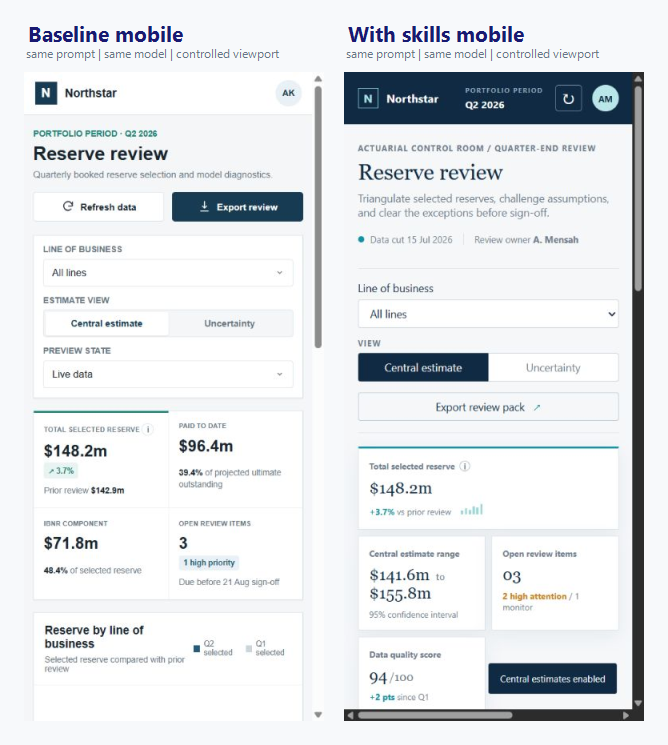

<p align="center">
  
</p>

<div align="center">

# Personal Agent Skills

**Portable skills for authored UI, natural expert writing, and rigorous AI-assisted research.**

21 skills | Codex + Claude Code | 66 trigger scenarios

[](https://github.com/aminemanai2003/personal-agent-skills/actions/workflows/validate.yml)
[](LICENSE)

</div>

This repository turns a small set of quality preferences into installable `SKILL.md` packages. The skills do not make a model expert by themselves and they do not guarantee a better result. Their value is narrower: they make important judgment criteria explicit, reusable, and easier to verify across projects.

## Main objective

The system is optimized for three outcomes:

| Outcome | Standard |
| --- | --- |
| Product-specific UI | The workflow, hierarchy, density, content, and visual direction should come from the product domain, not an interchangeable AI dashboard template. |
| Natural expert writing | Prose should follow the reader's real questions and the material's logic without canned transitions, filler, repeated conclusions, or synthetic cadence. |
| Serious research work | AI-assisted papers should have a defensible contribution, traceable evidence, reproducible methods, verified citations, bounded conclusions, and explicit limitations. |

## Do the skills help?

Yes, but not equally.

The skills tied directly to the three outcomes above provide the clearest value. They add explicit tests and procedures that a capable model may not apply consistently on its own. The general engineering and GitHub skills are useful as workflow guardrails, but much of their advice overlaps with behavior already expected from a strong coding agent.

| Area | Current evidence | Verdict |
| --- | --- | --- |
| UI | One same-model paired build. The skilled version has a more deliberate actuarial hierarchy, sharper exception-led workflow, and more domain-specific language. It also introduces page-level horizontal overflow at `390x844`, so the result is not an unqualified win. | Directionally useful; mobile quality still needs work. |
| Writing | One same-model paired passage. The baseline missed the strict word limit at 331 words; the skilled version finished at 320 and led from the actual decision problem. | Clear improvement in this pair. |
| Research | One same-model paired paper using the same four-source packet. Both were valid; the skilled version made the contribution, claim-evidence structure, and decision protocol more explicit. | Moderate improvement in this pair. |
| General workflow | Package validators, trigger-case coverage, and installer tests pass. Live trigger precision, recall, and repeated-run variance are not measured. | Useful for consistency, not yet proven as a capability lift. |

These are representative examples, not statistical benchmarks. See the [showcase methodology](evals/showcase/methodology.md) and [exact prompts](evals/showcase/prompts/).

## UI comparison

Both pages below were generated from the same prompt and model, with project-local skill availability as the main difference. They were then re-captured from the unchanged artifacts at the same `1440x960` CSS viewport.


The baseline exposes more conventional navigation and charting. The skilled version is more authored: it frames the page as an actuarial control room, emphasizes exceptions requiring judgment, uses reserve-specific terminology, and makes the review hierarchy easier to scan. The tradeoff is real: the skilled implementation is taller and its mobile layout overflows the page horizontally.

<details>
<summary>View the 390x844 mobile comparison</summary>



The baseline reflows without page-level horizontal overflow. The skilled result keeps its product-specific hierarchy, but the wide line-of-business table expands the document to `632px`, producing a horizontal page scrollbar.

</details>

The raw captures are available for [desktop baseline](evals/showcase/outputs/ui-before.png), [desktop skilled](evals/showcase/outputs/ui-after.png), [mobile baseline](evals/showcase/outputs/ui-before-mobile.png), and [mobile skilled](evals/showcase/outputs/ui-after-mobile.png).

## Skill map

Installing all 21 is reasonable because Codex sees skill metadata first and loads a skill body only when its description matches the task. Clear trigger descriptions and near-miss evaluations matter more than a small installed count. For a project, a smaller task-specific set still reduces ambiguity and makes behavior easier to audit.

| Layer | Skills | Role |
| --- | --- | --- |
| Quality core | `personal-operating-profile`, `anti-slop`, `definition-of-done` | Apply the confirmed priorities, remove generic output, and tie completion claims to evidence. |
| UI | `frontend-design`, `visual-ux-review`, `review-ui` | Create a domain-specific direction, inspect rendered states, and run complete UI readiness reviews. |
| Writing | `personal-writing` | Produce concise, natural, limitation-aware technical prose. |
| Research | `research-quality`, `research-topic` | Set evidence standards and carry an investigation through synthesis. |
| Engineering | `project-start`, `decision-making`, `code-quality`, `build-feature`, `review-code`, `root-cause-debugging` | Orient, decide, implement, diagnose, verify, and review repository work. |
| Security | `secure-development`, `security-review` | Build across sensitive boundaries with secure defaults and review reachable security risk without automatic mutation. |
| Career | `resume-and-ats`, `professional-profile`, `job-search-and-applications` | Produce truthful career artifacts, public proof, and focused application pipelines. |
| GitHub | `github-workflow` | Move focused work through commits, reviews, checks, and publication without expanding authority. |

The dependency and conflict boundaries are documented in [architecture/skill-dependencies.md](architecture/skill-dependencies.md) and [architecture/conflicts.md](architecture/conflicts.md).

## Quick start

Requirements:

- Python 3.10 or newer.
- A target project that supports repository-local Codex or Claude Code skills.

Clone the repository, then install every skill into a target project:

```powershell
python scripts/install_skills.py --target C:\path\to\project --host both
```

Install a smaller set by repeating `--skill`:

```powershell
python scripts/install_skills.py --target C:\path\to\project --host codex `
  --skill personal-operating-profile `
  --skill anti-slop `
  --skill definition-of-done `
  --skill frontend-design
```

Use `--host codex`, `--host claude`, or `--host both`. The installer is idempotent and refuses to overwrite a changed installed skill unless `--force` is supplied.

Codex discovers packages from `.agents/skills`. Claude Code uses `.claude/skills`. Host-specific notes are in [adapters/codex](adapters/codex/README.md) and [adapters/claude-code](adapters/claude-code/README.md).

To install selected skills globally for Codex, target your user directory so the installer writes to `~/.agents/skills`:

```powershell
python scripts/install_skills.py --target $env:USERPROFILE --host codex `
  --skill root-cause-debugging `
  --skill secure-development `
  --skill security-review `
  --skill resume-and-ats `
  --skill professional-profile `
  --skill job-search-and-applications
```

Having many skills installed is not inherently harmful. Avoid duplicate packages with conflicting instructions, keep descriptions precise, and let task relevance control which skill bodies and references load.

## Validation

Install the development dependency and run the repository checks:

```powershell
python -m pip install -r requirements-dev.txt
python scripts/validate_repo.py
python scripts/validate_evals.py
python scripts/validate_showcase.py
python -m unittest discover -s tests -v
```

What these checks prove:

- `validate_repo.py` checks package structure, required sections, provenance files, and agent metadata presence.
- `validate_evals.py` checks trigger-scenario schema and positive/near-miss coverage. It does not run a model.
- `validate_showcase.py` checks paired screenshot dimensions, stored word counts, and DOI coverage for the showcase artifacts.
- The unit tests cover idempotent installation and overwrite protection.

## Repository layout

```text
skills/         canonical portable skill packages
personal/       confirmed and inferred operating preferences
core/           cross-cutting quality contracts
architecture/   dependency, precedence, and conflict rules
sources/        provenance and adaptation notes
adapters/       Codex and Claude Code integration notes
evals/          trigger scenarios, prompts, outputs, and limitations
scripts/        installation and deterministic validation helpers
tests/          installer regression tests
decisions/      architecture decision records
```

## Extend the system

Keep a skill concise, trigger-specific, and focused on knowledge or procedure that changes agent behavior. Add detailed material under `references/` only when it should be loaded conditionally. New or changed skills should include provenance plus positive and near-miss trigger cases.

See [docs/extension.md](docs/extension.md) and [CONTRIBUTING.md](CONTRIBUTING.md) for the complete workflow.

## License

This project is released under the [MIT License](LICENSE). You may use, modify, distribute, and sell it, provided the copyright and license notices are retained.

## Project status

The repository is usable as a personal V1, is MIT-licensed for unrestricted reuse, and its local deterministic checks pass. One evidence gap remains:

- Repeated live model runs are still needed to measure trigger precision, result variance, and average quality lift.

The current evidence supports a practical conclusion: the focused UI, writing, and research skills are worth using as judgment scaffolding; the remaining workflow skills should be installed selectively when their orchestration or verification contract is useful.
