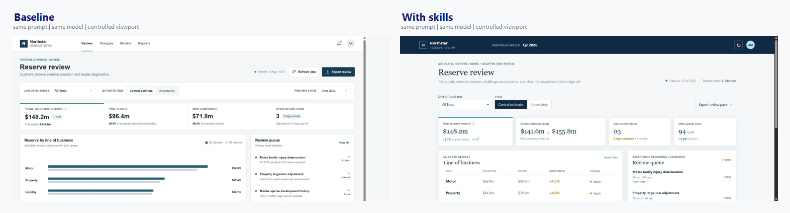

# Personal Agent Skills

A private, portable skills system for Amine's coding and research agents.

The repository combines reusable workflow knowledge with a small set of personal preferences. The goal is not to make an agent imitate a person mechanically. It is to make good professional judgment more consistent while preserving the ability to challenge weak assumptions.

## Design principles

- Evidence before completion claims.
- Inspect the repository and existing patterns before editing.
- Prefer small, composable workflows over a large instruction dump.
- Keep the shared skill core portable; put tool-specific behavior in adapters.
- Distinguish objective engineering quality from personal taste.
- Record provenance and adapt principles rather than copying external text.
- Make uncertainty, limitations, and unresolved decisions visible.

## Layout

```text
personal/       confirmed and inferred operating preferences
research/       ecosystem map and research notes
core/           cross-cutting quality and anti-slop rules
architecture/   dependencies, precedence, and composition rules
skills/         portable SKILL.md packages
sources/        provenance notes for composite skills
adapters/       Codex and Claude Code integration notes
evals/          realistic scenarios and evaluation records
decisions/      short architecture decision records
scripts/        deterministic validation helpers
```

## V1 Skill Catalog

- `personal-operating-profile`: apply confirmed and inferred preferences with precedence.
- `anti-slop`: remove generic, unjustified, and unfinished output.
- `decision-making`: choose defensible options under incomplete information.
- `definition-of-done`: match completion claims to direct evidence.
- `frontend-design`: create domain-specific interface directions.
- `visual-ux-review`: inspect rendered UI evidence and states.
- `code-quality`: implement and refactor compatible code.
- `research-quality`: calibrate claims to credible, reproducible evidence.
- `personal-writing`: write concise, factual project communication.
- `github-workflow`: move focused work through GitHub safely.
- `build-feature`: carry an authorized feature through implementation and handoff.
- `review-code`: report concrete code defects and regression risk.
- `review-ui`: orchestrate complete UI readiness reviews and focused fixes.
- `research-topic`: investigate a question through decision-ready synthesis.
- `project-start`: orient to an unfamiliar repository before substantial work.

## Same-model showcase

This is a controlled paired example, not a claim that skills guarantee a better result. Both conditions used AgentRouter-hosted `gpt-5.6-sol`, Codex CLI 0.147.0, medium reasoning effort, the same prompt, and isolated Git repositories. The baseline had no project-local skills; the comparison workspace contained only the named skills and their supporting packages. See the [methodology](evals/showcase/methodology.md) and [exact prompts](evals/showcase/prompts/).

### UI: `frontend-design` + `anti-slop`



Both runs produced a working Northstar actuarial reserve-review dashboard from the [same UI prompt](evals/showcase/prompts/ui.md). The baseline is a competent conventional dashboard. With `frontend-design` and `anti-slop`, the result uses a more deliberate actuarial control-room hierarchy, sharper typography, denser exception-led review flow, and domain-specific visual signals rather than relying mainly on a generic navigation-and-card template. Supporting skills available in the skilled condition were `definition-of-done` and `personal-operating-profile`.

The controls, filtering, uncertainty view, loading, empty, and warning states were exercised in a real browser with no console errors. The desktop image above is the stable comparison surface. Both pages reflow at 390 x 844; the skilled result still has horizontal scrolling around its wide line-of-business table, so this run should not be read as a perfect mobile implementation. [Open the baseline capture](evals/showcase/outputs/ui-before.png) or [the skilled capture](evals/showcase/outputs/ui-after.png).

### Writing: `personal-writing` + `anti-slop`

The [same writing prompt](evals/showcase/prompts/writing.md) asked for a 260-320 word passage for actuarial and machine-learning practitioners. The baseline opened with a generic leaderboard frame and finished at 331 words, outside the requested limit:

> A single composite score can make a claims-reserving benchmark easier to rank, but it can also conceal the distinctions that matter most in practice. Predictive accuracy, calibration, stability across accident years, and computational cost answer different questions.

With `personal-writing` and `anti-slop`, supported by `personal-operating-profile`, the passage finished at exactly 320 words and led from the actual decision problem:

> A single composite score can obscure the choice a claims-reserving benchmark is meant to inform because its components measure different kinds of performance. Predictive accuracy asks how closely estimates track observed outcomes under a loss function. Calibration asks whether predicted reserve levels or distributions are systematically too high or too low.

The skilled passage also turns the abstract warning into a concrete governance test: quarterly reporting may penalize instability and miscalibration, while exploratory segmentation may accept volatility for speed or sharper local predictions. Read the [complete baseline](evals/showcase/outputs/writing-before.md) and [complete skilled passage](evals/showcase/outputs/writing-after.md).

### Research: `research-topic` + `research-quality`

Both runs received the same [research prompt](evals/showcase/prompts/research.md) and [controlled source pack](evals/showcase/research/source-pack.md), limited to four DOI-verified sources. Neither condition could browse for extra evidence. The baseline produced a valid 1,482-word note and correctly separated the proposed framework from the cited literature:

> The framework begins by identifying the forecast object required: a point reserve, predictive distribution, uncertainty measure, or combination. Evaluation then proceeds across five dimensions. The first three are grounded in the packet's emphasis on prediction and uncertainty; stability and cost are proposed extensions connecting statistical evaluation to repeated operational use.

With `research-topic`, `research-quality`, `personal-writing`, and `anti-slop`, the 1,438-word note states the contribution more compactly and makes non-compensable constraints explicit:

> A scalar ranking can make unlike deficiencies appear exchangeable. A gain in point accuracy might numerically offset poor distributional performance, unstable estimates, or an operational burden, even when the use case makes one weakness unacceptable.

Both papers contain the required sections and all four supplied DOIs; neither invents a dataset, experiment, quotation, or universal winner. The skilled version's main advantage in this single pair is a tighter claim-evidence structure and a six-step protocol that ties each metric to the forecast object, consequences of error, thresholds, and validation design. Read the [complete baseline paper](evals/showcase/outputs/research-before.md) and [complete skilled paper](evals/showcase/outputs/research-after.md).

## Install

The canonical source is `skills/`. Install the packages into a target project for both hosts:

```powershell
python scripts/install_skills.py --target C:\path\to\project --host both
```

Use `--host codex` or `--host claude` for one host. The installer is idempotent and refuses to overwrite a changed installed skill unless `--force` is supplied.

Codex discovers the installed packages from `.agents/skills`. Claude Code uses `.claude/skills`; host-specific notes are in `adapters/`.

## Use and extend

Read `personal/operating-profile.md` and `core/definition-of-done.md` before extending the system. Read only the relevant skill and referenced material for a task.

To add a skill, use the standard package shape (`SKILL.md`, optional `references/`, `scripts/`, or `assets/`) and add a provenance file under `sources/`. Keep the description trigger-specific, add positive and near-miss cases to `evals/evals.json`, then run:

```powershell
.\.venv\Scripts\python.exe scripts/validate_repo.py
.\.venv\Scripts\python.exe scripts/validate_evals.py
```

The repository uses small commits so each skill or support concern can be reviewed independently. See `docs/extension.md` and `CONTRIBUTING.md` for the full workflow.

## Rule precedence

1. System and platform safety rules.
2. Explicit user instructions for the current task.
3. Repository and project rules discovered in `AGENTS.md`, `CLAUDE.md`, and equivalent files.
4. Objective engineering quality and applicable standards.
5. This repository's personal preferences.
6. A skill's local defaults.

When rules conflict, preserve the higher-precedence rule, state the conflict briefly, and choose the smallest change that satisfies the task.

## Status

This repository is usable as a V1 system. The personalization interview confirmed three north-star outcomes: authored non-generic UI, natural expert prose, and rigorous human-expert-quality AI-assisted research papers. Unspecified workflow choices use professional defaults. The deterministic evaluation suite passes; independent repeated model-run variance benchmarks remain a future improvement.
